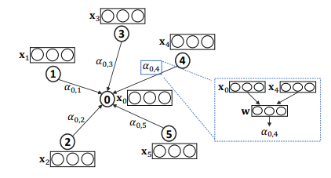
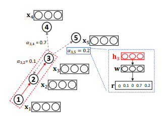

# Attention Models in Graphs: A Survey

## TYPES OF GRAPH ATTENTION MECHANISM

应用于图结构数据的三种主要注意力机制方法：学习注意力权重，基于相似性的注意力，注意力引导的游走法。这三种注意力机制具有相同的目的或意图，但是他们在定义或实现注意力机制的方法方面存在差异。

> 解释（图注意力）：给定一个目标图对象（eg：节点，边，图等），$v_0$ 和 一个在$v_0$的邻域$\left\{v_{1}, \cdots, v_{\left|\Gamma_{v_{0}}\right|}\right\} \in \Gamma_{v_{0}}$内的图对象集合。注意力被定义为将$\Gamma_{v_{0}}$中每个对象映射到相关性得分的函数$f^{\prime} :\left\{v_{0}\right\} \times \Gamma_{v_{0}} \rightarrow[0,1]$，该相关性得分表示每个特定相邻对象的关注程度。而且满足：
> $$\sum_{i=1}^{\left|\Gamma_{v_{0}}\right|} f^{\prime}\left(v_{0}, v_{i}\right)=1$$

### 1、学习注意力权重

对于给定$v_{0}, v_{1}, \cdots, v_{\left|\Gamma_{x_{0}}\right|}$的相应的属性/特征 $\mathbf{x}_{0}, \mathbf{x}_{1}, \cdots, \mathbf{x}_{ | \Gamma_{o^{*}}} |$ ，注意力权重可以通过以下公式计算：

$$
\alpha_{0, j}=\frac{e_{0, j}}{\sum_{k \in \Gamma_{v_{0}}} e_{0, k}}
$$

其中，$e_{0, j}$ 表示与$v_0$相邻的节点$v_j$。

在实际中，通过考虑他们的属性，可以利用带有可训练函数的softmax函数来计算$v_j$和$v_0$间的相关性。在 GAT 中实现的公式如下：

$$
\alpha_{0, j}=\frac{\exp \left(\text { LeakyReLU }\left(\mathrm{a}\left[\mathrm{Wx}_{0} \| \mathrm{W} \mathrm{x}_{j}\right]\right)\right)}{\sum_{k \in \Gamma_{v_{0}}} \exp \left(\text { LeakyReLU }\left(\mathbf{a}\left[\mathbf{W} \mathbf{x}_{0} \| \mathbf{W} \mathbf{x}_{k}\right]\right)\right)}
$$

其中，$a$ 表示一个可训练的注意力向量，$W$ 输入特征映射到隐藏空间的可训练权重矩阵，$||$表示连接。

> 如上图，对于一个目标对象$v_0$，在邻域中对对象$i$分配一个重要的权重$a_(0,i)$。通过测试 $v_0$ 和 $v_i$、$x_0$ 和 $x_i$ 的隐藏嵌入来分配重要性的函数来实现。

### 2 基于相似性的注意力

对于给定的具有相关性的属性或特征，基于相似性的注意力能够学习除了关键的差异之外的相似性。同时，该方法更多的关注那些具有相似性的隐藏表示或特征的对象。如下公式所示：

$$
\alpha_{0, j}=\frac{\exp \left(\beta \cdot \cos \left(\mathbf{W} \mathbf{x}_{0}, \mathbf{W} \mathbf{x}_{j}\right)\right)}{\sum_{k \in \Gamma_{v_{0}}} \exp \left(\beta \cdot \cos \left(\mathbf{W} \mathbf{x}_{0}, \mathbf{W} \mathbf{x}_{k}\right)\right)}
$$

其中，$\beta$ 表示可训练偏差，$W$ 表示从输入映射到隐藏空间的可训练权重矩阵。

该方法的定义和学习注意力权重的方法相似，主要的区别在于，该模型显示地为彼此相关地对象学习类似地隐藏嵌入，因为该模型主要关注于基于相似性或对齐。

### 3 注意力引导的游走法

前两种基于注意力的方法主要将注意力集中于选择相关的信息，并将这些信息整合到目标对象的隐藏表示中。第三种基于注意力的方法主要的不同的在于使用了 GAM。

GAM方法在输入图上采取一系列步骤，并使用RNN对已访问节点进行编码，以构建子图嵌入。

在时间t的RNN隐藏状态,$\mathbf{h}_{t} \in \mathbb{R}^{h}$ 对来自步骤$1, \cdots, t$中已访问的节点信息进行编码。然后，定义基于注意力的函数$f^{\prime} : \mathbb{R}^{h} \rightarrow \mathbb{R}^{k}$，用于将输入的隐藏向量$f^{\prime}\left(\mathbf{h}_{t}\right)=\mathbf{r}_{t+1}$映射到一个k维秩向量中，它告诉我们下一步需要优先考虑哪些k类型节点，以帮助模型为下一步确定特定类型的相邻节点优先级。如下图所示：

> 如上图，隐藏嵌入$h_3$表示在长度$L=3$的行走之后的信息$\left(x_{1}, \cdots, x_{3}\right)$，并将该信息输入到排序函数中，以确定各个邻接节点的重要性并用于下一步。