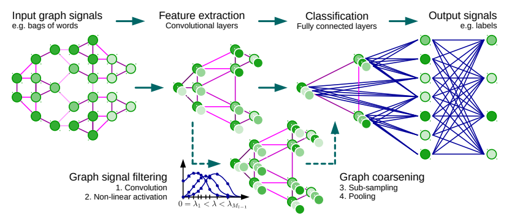

# Convolutional Neural Networks on Graphs with Fast Localized Spectral Filtering
> 作者：Michaël Defferrard
> year：2016

## Abstract

将 CNN 从低维度规则网络推广到高纬度不规则领域。在谱图理论（spectral graph theory）的背景下，提出 CNNs 的公式，它提供有用的数学背景和有效的数值方案，以在图上设计快速局部卷积滤波器。这种技术与经典 CNN 具有相似的线性计算复杂度和恒定学习复杂度，同时，对任何图结构适用。

## 介绍

### 1、CNN 能力
- CNN 通过揭示跨数据域共享的局部特征来提取输入数据或信号的局部平稳性，这些类似的特征可以用从数据中学习到的滤波器或内核进行识别。
- 卷积滤波器是移位或平移不变滤波器，他们能够独立于其空间位置识别相同特征。

### 2、CNNs 推广到图中的主要问题
- 定义一个能够有效评估和学习图特征的局部图滤波器（localized graph filters ）

### 3、本文的贡献
- **谱公式（spectral formulation）**：基于已有图信号处理（graph signal processing, GSP）工具的 CNN 谱图理论公式；
- **严格的局部滤波器（Strictly localized filters）**：所提出的谱滤波器 Enhancing 能够被证明严格局部化于半径为 $K$ 的球内；
- **计算复杂度低（Low computational complexity）**：该滤波器的计算复杂度为线性复杂度；
- **有效地池化（Efficient pooling）**：将顶点重新排序为二叉树结构之后，利用类似于一维信号池化的方法进行处理；
  
## 所提出的方法
CNN 推广到图中所需步骤，如图所示：
- 图上的局部卷积滤波器设计；
- 将图中相似的顶点组合在一起的图粗化操作；
- 将空间分辨率转化为更高过滤分辨率的图池化操作。

> 图上的CNN框架和（图）卷积层的四个步骤

### 1、学习快速局部谱滤波器

定义卷积滤波器的两种方法：
- 空间方法（spatial approach）
  
  介绍：利用有限大小的内核过滤局部化
  局限性：虽然图卷积在空间领域是可以想象的，但是如[[Bruna at.el.](https://arxiv.org/abs/1312.6203)]他面临着与局部邻居匹配的挑战，因此，从空间角度来说，图上的变换没有独特的数学定义。

- 频谱方法（spectral approach）

  介绍：通过在频谱领域中，实现带有 Kronecker delta的卷积，在图上提供一个定义明确的局部化算子。卷积定理将卷积定义为傅里叶基（Fourier basis）中对角化的线性算子
  问题：在频谱领域定义的滤波器不是自然局部化的，并且由于$\mathcal{O}\left(n^2\right)$乘以图傅里叶基，所以平移成本很高

这些问题可以通过特殊的滤波器参数化选择解决。

#### 1.1 图傅里叶转化（Graph Fourier Transform）

在无向和连接的图$\mathcal{G}=(\mathcal{V}, \mathcal{E}, W)$上定义处理信号，其中，$\mathcal{V}$是一个 $|\mathcal{V}|=n$ 的有限顶点集，$\mathcal{E}$ 是一个边的集合，$W \in \mathbb{R}^{n \times n}$ 是一个编码两个连接的节点间权重的加权邻接矩阵。
在图的节点上定义信号 $x$:$\mathcal{V} \rightarrow \mathbb{R}$，可以被认为是一个向量$x \in \mathbb{R}^{n}$，其中$x_{i}$是第$i$个节点的值。
一个在频谱图分析中的主要算子是图拉普拉斯（graph Laplacian），它的组合定义为$L=D-W \in \mathbb{R}^{n \times n}$，其中$D \in \mathbb{R}^{n \times n}$是带有$D_{i i}=\sum_{j} W_{i j}$的对角矩阵；和正则化定义为 $L=I_n-D^{-1 / 2} W D^{-1 / 2}$，其中 $I_n$ 为单位矩阵。
$L$ 是实对称半正定矩阵，它具有一组完整的正交特征向量$\left\{u_{l}\right\}_{l=0}^{n-1} \in \mathbb{R}^{n}$，称为图傅里叶基，以及他们的相关的有序实非负特征值 $\left\{\lambda_{l}\right\}_{l=0}^{n-1}$，即图的频率。利用傅里叶基$U=\left[u_{0}, \ldots, u_{n-1}\right] \in \mathbb{R}^{n \times n}$ 对拉普拉斯进行对角化，例如$L=\hat{U} \Lambda U^{T}$，其中$\Lambda=\operatorname{diag}\left(\left[\lambda_{0}, \ldots, \lambda_{n-1}\right]\right) \in \mathbb{R}^{n \times n}$。信号$x \in \mathbb{R}^{n}$ 的图傅里叶转化被定义为$\hat{x}=\tilde{U}^{T} x \in \mathbb{R}^{n}$，并且他的反函数为$x=U \hat{x}$。与欧几里德空间一样，该变换可以实现过滤等基本操作。

#### 1.2 图信号的谱过滤（Spectral filtering of graph signals）

  由于无法在顶点域中表达有意义的转换操作，所以图$*_{\mathcal{G}}$上的卷积操作在傅里叶域中被定义为 $x *_{\mathcal{G}} y=U\left(\left(U^{T} x\right) \odot\left(U^{T} y\right)\right)$，其中 $\odot$ 逐元素的 Hadamard 计算。通过 $\mathcal{g} \theta$ 过滤信号$x$，如下：
$y=g_{\theta}(L) x=g_{\theta}\left(U \Lambda U^{T}\right) x=U g_{\theta}(\Lambda) U^{T} x$

  非参数滤波器，即参数全部自由的滤波器，定义如下：
  $g_{\theta}(\Lambda)=\operatorname{diag}(\theta)$
  其中，参数$\theta \in \mathbb{R}^{n}$是一个傅里叶系数的向量。

#### 1.3 局部滤波器的多项式参数化（Polynomial parametrization for localized filters） 
  非参数滤波器的两个局限性：
  - 他们不局限于空间；
  - 学习复杂度为$\mathcal{O}(n)$；
  
  该问题可以利用多项式滤波器可以解决：
  $g_{\theta}(\Lambda)=\sum_{k=0}^{K-1} \theta_{k} \Lambda^{k}$

  其中，参数$\theta \in \mathbb{R}^{K}$是一个多项式系数向量。以顶点$i$为中心的滤波器$g_{\theta}$的顶点$j$处的值由$\left(g_{\theta}(L) \delta_{i}\right)_{j}=\left(g_{\theta}(L)\right)_{i, j}=\sum_{k} \theta_{k}\left(L^{k}\right)_{i, j}$给出，其中通过带有 Kronecker delta 的函数$\delta_{i} \in \mathbb{R}^{n}$的卷积来定义核。根据[[Lemma](https://arxiv.org/abs/0912.3848)]，$d_{\mathcal{G}}(i, j)>K$ implies $\left(L^{K}\right)_{i, j}=0$，其中$d_{\mathcal{G}}$为最短路径距离。因此，拉普拉斯的$K$阶多项式表示的频谱滤波器刚好是$K$局部化的。此外，他的信心复杂度为$\mathcal{O}(K)$，滤波器的支持大小，因此与传统的CNN具有相同的复杂度。

#### 1.4 用于快速过滤的递归公式（Recursive formulation for fast filtering） 
对于学习带有K个参数的局部滤波器，因为需要乘以傅里叶基$U$，所以信号$x$ 计算$y=U g_{\theta}(\Lambda) U^{T} x$的计算复杂度为$\mathcal{O}\left(n^{2}\right)$。该问题的解决方法是将$g_{\theta}(L)$参数化为可以从$L$递归计算的多项式函数，因为用 K 乘以一个稀疏$L$的成本为$\mathcal{O}(K|\mathcal{E}|) \ll \mathcal{O}\left(n^{2}\right)$。传统上采用 GSP 以近似核的多项式称为 切比雪夫（Chebyshev）扩展。另一种方式是采用 Lanczos 算法构建一个Krylov子空间$K$的标准正交基，由于系数的独立性，该方法更具吸引力，但是该方法比较复杂。

对于$k$阶 切比雪夫多项式（Chebyshev polynomial）$T_{k}(x)$可以利用固定的递归关系$T_{k}(x)=2 x T_{k-1}(x)-T_{k-2}(x)$，其中，$T_{0}=1$和$T_{1}=x$进行计算。这些多项式形成$L^{2}\left([-1,1], d y / \sqrt{1-y^{2}}\right)$的正交基（orthogonal basis），关于度量$d y / \sqrt{1-y^{2}}$的平方可积函数的Hilbert空间。因此，可以将滤波器参数化为截断的扩展：
$$
g_{\theta}(\Lambda)=\sum_{k=0}^{K-1} \theta_{k} T_{k}(\tilde{\Lambda})
$$

其中，参数$\theta \in \mathbb{R}^{K}$是切比雪夫系数（Chebyshev coefficients）的向量，$T_{k}(\tilde{\Lambda}) \in \mathbb{R}^{n \times n}$ 为 $\tilde{\Lambda}=2 \Lambda / \lambda_{\max }-I_{n}$的$k$阶切比雪夫多项式。滤波器操作可以被写为$y=g_{\theta}(L) x=\sum_{k=0}^{K-1} \theta_{k} T_{k}(\tilde{L}) x$，其中$T_{k}(\tilde{L}) \in \mathbb{R}^{n \times n}$ 是在缩放的拉普拉斯算子 $\tilde{L}=2 L / \lambda_{\max }-I_{n}$ 处评估的$k$阶切比雪夫多项式。$\overline{x}_{k}=T_{k}(\tilde{L}) x \in \mathbb{R}^{n}$ 表示，我们可以使用递归关系计算$\overline{x}_{k}=2 L \overline{x}_{k-1}-\overline{x}_{k-2}$，其中 $\overline{x}_{0}=x$ and $\overline{x}_{1}=\tilde{L} x$。整个滤波操作$y=g_{\theta}(L) x=\left[\overline{x}_{0}, \ldots, \overline{x}_{K-1}\right] \theta$的时间复杂度为$\mathcal{O}(K|\mathcal{E}|)$。

#### 1.5 学习滤波器（Learning filters）
样本s的第$j$个输出特征映射由下式给定：
$$
y_{s, j}=\sum_{i=1}^{F_{i n}} g_{\theta_{i, j}}(L) x_{s, i} \in \mathbb{R}^{n}
$$

其中，$x_{s, i}$ 为输入特征映射，切比雪夫系数$\theta_{i, j} \in \mathbb{R}^{K}$ 的$F_{i n} \times F_{o u t}$向量是层可训练参数。带有负向传播算法的训练多层卷积层，需要两个梯度：
$$
\frac{\partial E}{\partial \theta_{i, j}}=\sum_{s=1}^{S}\left[\overline{x}_{s, i, 0}, \ldots, \overline{x}_{s, i, K-1}\right]^{T} \frac{\partial E}{\partial y_{s, j}} \qquad \text { and } \quad \frac{\partial E}{\partial x_{s, i}}=\sum_{j=1}^{F_{o u t}} g_{\theta_{i, j}}(L) \frac{\partial E}{\partial y_{s, j}}
$$

其中，$E$为一小批样本$S$的损失能量。上述三种计算中的每一种归结为 $K$个稀疏矩阵-向量乘法和一个密集矩阵-向量乘法，时间复杂度为$\mathcal{O}\left(K|\mathcal{E}| \tilde{F}_{i n} F_{o u t} S\right)$。这个可能通过在并行框架下利用张量操作进行有效计算。最后，$\left[\overline{x}_{s, i, 0}, \ldots, \overline{x}_{s, i, K-1}\right]$只需要计算一次。

### 2、图粗化 （Graph Coarsening）

池化操作要求图上有意义的邻域，其中类似的顶点聚集在一起。对多个层执行此操作相当于保留局部几何结构的图的多尺度聚类。然而，图聚类是一个NP难问题而且必须使用近似值。我们对多级聚类算法感兴趣，其中每个级别产生较粗略的图，该图对应于视为不同分辨率的数据域。

本文采用Graclus 多级聚类算法（Graclus multilevel clustering algorithm）的粗化阶段[[Dhillon 2007]()]。

Graclus 采用贪心算法来计算给定图的连续较粗糙版本，并且能够最小化几个流行的频谱聚类目标，并从中选择归一化切割。Graclus的贪婪规则在每个粗化层面都包含选择未标记的顶点i并将其与其未标记的邻居j匹配，以最大化局部归一化切割$W_{i j}\left(1 / d_{i}+1 / d_{j}\right)$。然后标记两个匹配的顶点，并将粗化的权重设置为它们的权重之和。 重复匹配，直到探索了所有节点。 这是一种非常快速的粗化方案，它将节点数量从一个级别划分为下一个较粗级别的大约两个（可能存在一些单例，非匹配节点）。

### 3、图信号的快速池化 （Fast Pooling of Graph Signals）

在粗化之后，输入图的顶点和他们的粗化版本在一些有意义的方法中进行排序。因此，池化从中的一个直接应用需要一个表格来存储所有匹配的顶点。这种方法会导致内存效率低下，速度慢且难以并行化等问题。然而，可以布置顶点使得图形池化操作变得与1D池化一样有效。
我们进行以下两个步骤：
- 常规节点（和单例）要么有两个常规节点（例如图2中的1级顶点0）
- 一个单例和一个假节点作为子节点（例如2级顶点0）
- 假节点总是有两个假节点作为子节点（例如1级顶点1）

输入信号在假节点处用中性值初始化，例如， 使用最大池的ReLU激活时为0。 由于这些节点已断开连接，因此过滤不会影响初始中性值。虽然那些假节点人为地增加了维度，从而增加了计算成本，但我们发现，在实践中，Graclus留下的单身人数非常少。任意地对最粗略级别的节点进行排序，然后将该排序传播到最精细的级别，即节点k具有作为子节点的节点2k和2k + 1，产生最精细级别的常规排序。在相邻节点以较粗糙的级别分层合并的意义上是规则的。 汇集这样的重新排列的图形信号类似于汇集常规的1D信号。这种规则的安排使得操作非常有效并且满足诸如GPU的并行架构，因为存储器访问是本地的，即不必获取匹配的节点。

> 图粗化和池化的例子.在 以最好的图作为输入的$G_0$上生成的信号$x \in \mathbb{R}^{8}$ 上执行大小为4的最大池化（或者两个大小为2的最大池化）。注意到其最初拥有$n_{0}=\mathcal{V}_{0} |=8$个顶点的任意排序。对于大小为4的池化操作，需要两个大小为2的粗化操作：让Graclus 给出尺寸为 $n_{1}=\left|\mathcal{V}_{1}\right|=5$d的$\mathcal{G}_{1}$，然后大小为$n_{2}=\left|\mathcal{V}_{2}\right|=3$的$\mathcal{G}_{2}$的最粗糙的图。因此将尺寸设置为$n_{2}=3, n_{1}=6, n_{0}=12$并且假节点（蓝色）被添加到$\mathcal{V}_{1}$（1个节点）和$\mathcal{V}_{0}$（4个节点）以与singeltons（橙色）配对，使得每个 节点只有两个孩子。 然后任意排序$\mathcal{V}_{2}$中的节点，因此对$\mathcal{V}_{1}$和$\mathcal{V}_{0}$中的节点进行排序。 此时，$\mathcal{V}_{0}$中顶点的排列允许在$x \in \mathbb{R}^{12}$上进行常规1D汇集，使得$z=\left[\max \left(x_{0}, x_{1}\right), \max \left(x_{4}, x_{5}, x_{6}\right), \max \left(x_{8}, x_{9}, x_{10}\right)\right] \in \mathbb{R}^{3}$，其中信号分量$x_{2}, x_{3}, x_{7}, x_{11}$被设置为中性值

