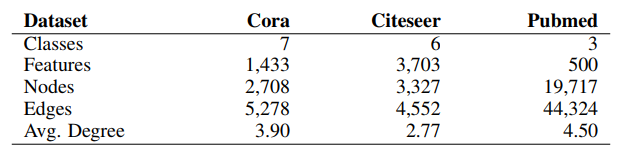
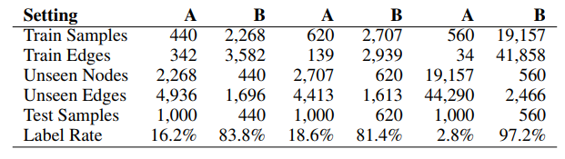
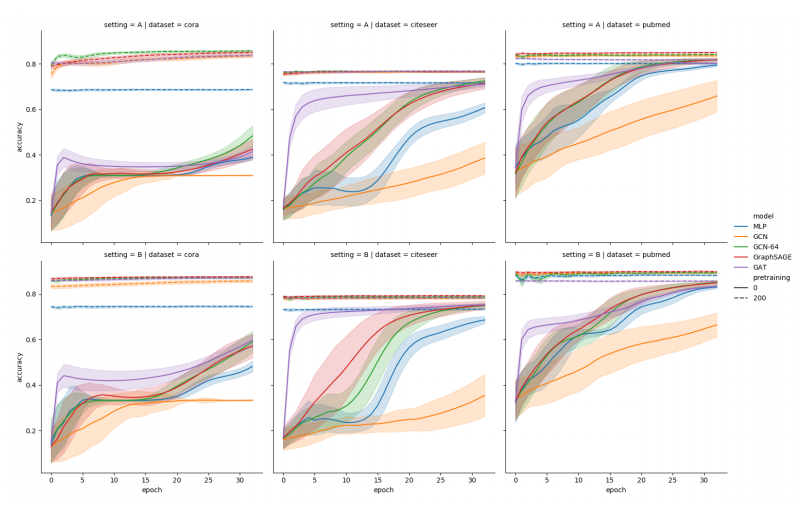

# Can GNN go “online”?an analysis of pretraining and inference

## 0 引言

目前，GCN 及其变体（例如：[GCN](https://archwalker.github.io/blog/2019/06/01/GNN-Triplets-GCN.html)、[GraphSAGE](https://archwalker.github.io/blog/2019/06/01/GNN-Triplets-GraphSAGE.html)、[GAT](https://archwalker.github.io/blog/2019/06/01/GNN-Triplets-GAT.html)）在图结构数据的学习方面都取得了不错的效果，特别是采用 [Transductive learning](https://archwalker.github.io/blog/2019/06/01/GNN-Triplets-GraphSAGE.html) 学习方式时，即测试集和验证集在训练的时候是可见的情况下。

然而，在很多实际应用中，大规模图结构数据通常不是静态的而是动态的，即随着时间的的推移会出现新的节点和边插入，例如社交网络，引文网络或者一些在线图结构数据应用。

本篇博文将为大家介绍该问题，以及通过对比实验对改问题进行分析与总结。该博文主要来自论文 [Can GNN go “online”?an analysis of pretraining and inference](https://arxiv.org/pdf/1905.06018)，该论文重点讨论以下问题：

1. 假设图结构中节点和边在训练过程中都是已知的，如果加入未知节点和边时，使用预训练的 GNN 方式或从头开始重新训练的方式，哪一种方式效果更好？

## 1 动机

虽然 GNN 模型及其变体在图结构数据的学习方面取得了成功，但是 GNNs 所采用的学习方式大多都是 Transductive learning 学习方式，该学习方式主要特点是在训练图结构节点数据收集邻居信息的时候，会用到了测试或者验证样本。

然而，在很多实际应用中，大规模图结构数据每个时候都在发生变化，即每个时候都有可能有新的节点或边插入图结构数据中。举个例子，在推荐系统中，每个时段都会有新的用户（节点）或新的关系（边）加入原有关系网络中，而这些新的用户（节点）或新的关系（边）都会对已训练好的模型造成一定的影响。

目前研究的大多数 GNN 模型及其变体都缺乏推理能力的潜在缺点。即每当有新的节点或边插入时，已训练好的模型将不具备有预测新节点或边的能力。所以一般会采取以下两种方式：

1. 从头开始重新训练模型，但是该方法可能是昂贵的，因为需要消耗大量的人力物力资源；
2. 使用预训练模型进行少量推理步骤的可能性，但目前尚未对这种方式进行评估，即无法判断预训练模型是否是处理图结构数据中更新的有效方法。

## 2、实验方法

为了评估 GNN 及其变体（GNN，GraphSAGE，GAT）的推理能力，该论文将 GNN 及其变体（GNN，GraphSAGE，GAT）应用于两个 train-test 实验中，其中一个是具有大量带标签节点的数据集，另外一个是具有少量带标签节点的数据集。训练结束后，将不可见的节点和边插入到图结构中，并对模型进行有限量的参数更新。最后，分析训练模型在每个推理时期之后的测试准确性，并对带有预训练的网络性能和未预训练的网络性能进行评估与比较。

训练过程可以被分为以下两步：

1. 在带标签的训练集中预训练模型；
2. 将不可见的节点和边插入到图中，并继续训练有限次的推理步骤。不可见节点没有引入新标签，相反，不可见节点提供特征和可能连接已知带标签的节点。

在第一个之前和每一个推理步骤之后，在测试节点上评估准确率，这些测试节点是不可见节点的子集。

对于每个模型，我们使用200个预训练时期与没有预训练进行比较。

在后一种情况下，训练在推理期间开始，这相当于每当插入新节点和边时从头开始重新训练。 这使我们能够评估预训练是否有助于在动态图上应用图神经网络。

## 3、实验超参数设置

在实验中，论文采用了相同的超参数：

1. 对于 GCN，论文每层使用 16 或者64（由GCN-64表示）隐藏单位，激活函数为 ReLU，dropout 值为 0.5，学习率为 0.005和权重损失为 0.0005；

2. 对于 GAT，论文在第一层使用 8 个隐藏单元和 8 个attention heads，第二层使用 1 个attention heads，学习率为 0.005和权重损失为 0.0005；

3. 对于 GraphSAGE，论文每层使用64个隐藏单元，具有平均聚合能力，激活函数为 ReLU，dropout 值为 0.5，学习率为 0.005和权重损失为 0.0005；

4. 对于 MLP baseline，论文使用带有 64 个隐藏单元的隐藏层，激活函数为 ReLU，dropout 值为 0.5，学习率为 0.005和权重损失为 0.0005。

## 4、实验数据集

论文所用的三个标注引用数据集分别为：Cora, Citeseer, and Pubmed，其中，文本特征和带有类别标签用节点表示，引用关系用边表示。为了使这些数据集能够用于 inductive learn学习方式，论文设置了一些不可见节点。

# 5、实验组设置

如下图所示，论文对每个数据集采用不同的 train-test 分割：

Few-many setup (A)：由一些标记的节点组成，这些节点可以推理训练集和许多未标记的节点。

many-few setup (B)：包括许多训练节点和很少的测试节点。通过反转 setup A的 train-test mask 进行设置，并相应地分配边。设置B的动机来自应用程序，其中已知大图并且随时间发生增量变化，例如引用推荐，社交网络中的链接预测等。

# 6、实验结果

三个模型在三个数据集上的实验结果如下图所示：

预训练模型的得分始终高于非预训练模型，同时方差明显较小。 在几个推断时期之后（在Cora-A和Pubmed-B上高达10），预训练模型的准确性稳定。 没有任何预训练，GAT显示了最快的学习过程。 预训练图神经网络的绝对分数高于MLP。 从广义的角度来看，预训练图神经网络的得分都处于同一水平。 虽然GCN在Cora-B上落后于其他的，但GAT在Pubmed上落后于其他的。

许多设置B的绝对分数高于少数设置A的绝对分数。 我们通过测量精确度分布之间的Jensen-Shannon散度来全局比较设置A和B的结果。 两种设置之间的Jenson-Shannon偏差在预训练时较低（GAT为0.0057，MLP为0.0115），而没有预训练（GraphSAGE为0.0666，GCN为0.1013）。

# 7、实验结论

我们已经开发了一个实验装置来评估图神经网络的推理能力，我们用它来对着名的引用图数据集进行归纳实验：Cora，Citeseer和Pubmed。

我们的结果表明，即使我们在训练后插入新的节点和边，图神经网络仍然表现良好。

对于本研究中考虑的三个数据集，在非常少的推断时期之后的准确性平稳。 这种观察结果适用于 train-test 分割设置：许多和少数。

我们通过测量 Jenson-Shannon 证实了两种训练分裂中的准确度分布相似。

预训练模型的低方差表明，每个预训练模型的100次运行收敛以产生类似的准确度分数，并且它们对于添加看不见的节点是鲁棒的。

所使用的模型都包括两层。 因此，模型仅利用每个标记节点的 two-hop 邻域中的节点特征。

从技术上讲，也可以使用更远的节点功能，尤其是在推理过程中。 然而，模型深度仍然是图域中的一个开放问题。 理论上，更深的模型可以利用更远的节点的特征。

评估推理能力非常重要，因为在大型图上进行全面的重新训练可能并不可行。 我们已经迈出了第一步，使图神经网络的当前研究更接近实际应用。 我们的设置接近实际应用程序，新节点随时间动态显示。 我们的研究结果表明，在数据变化时保持一个模型并继续训练过程是处理动态图的有效方法。