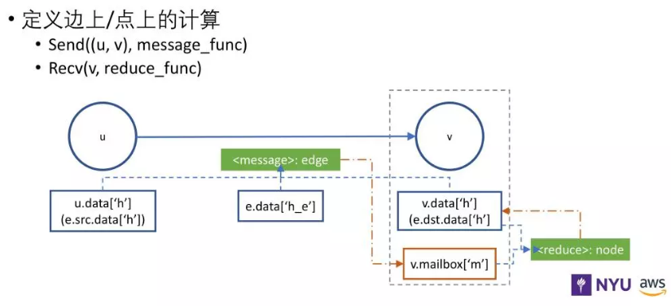

# DGL 入门

## 引言


## DGL 核心 —— 消息传递 

DGL 的核心为消息传递（message passing），主要分为消息函数 （message function）和累加函数（reduce function）。如下图所示：



消息函数（message function）：首先对边所关联的节点进行计算，以计算该边的出发节点的表示信息（e.src.data）、该边的目标节点的表示信息（e.dst.data）、该边自身的表示信息（e.data）；然后将这些表示信息作为消息传递给其邻居。

累加函数（reduce function）：首先，邻居节点从邮箱（v.mailbox['m']）中汇聚消息函数所传递过来的消息（message），并清空邮箱（v.mailbox['m']）内消息；然后，邻居节点结合邮箱（v.mailbox['m']）中的消息（message）和该节点信息，计算并更新节点的表示信息。


## GCN 的数学表达

GCN 的逐层传播公式如下所示：

$H^{(l+1)}=\sigma\left(\tilde{D}^{-\frac{1}{2}} \tilde{A} \tilde{D}^{-\frac{1}{2}} H^{(l)} W^{(l)}\right)$

该公式的形象解释：每个节点拿到邻居节点信息然后汇聚到自身 embedding 上。具体 GCN 内容介绍可参考【[GNN 教程：GCN](https://archwalker.github.io/blog/2019/06/01/GNN-Triplets-GCN.html)】。

## 从消息传递的角度分析 GCN

本章，我们将从消息传递的角度对 GCN 进行分析，其分析过程可以被概括为以下步骤：

1. 在 GCN 中每个节点都有属于自己的表示 $h_i$;
2. 根据消息传递（message passing）的范式，每个节点将会收到来自邻居节点发送的 message（表示）；
3. 每个节点将会对来自邻居节点的 message（表示）进行汇聚以得到中间表示 $\hat{h}_i$ ；
4. 对中间节点表示 $\hat{h}_i$ 进行线性变换，然后在利用非线性函数$f$进行计算：$h^{new}_u=f\left(W_u \hat{h}_u\right)$;
5. 利用新的节点表示 $h^{new}_u$ 对该节点的表示 $h_u$进行更新。

## 具体实现

在 GCN 的具体实现过程中，可以分为消息函数 （message function）和累加函数（reduce function）定义模块和非线性函数$f$定义模块。

step 1，我们需要引入相关包。

```python
import dgl
import dgl.function as fn
import torch as th
import torch.nn as nn
import torch.nn.functional as F
from dgl import DGLGraph

```

step 2，我们需要定义 GCN 的 message 函数和 reduce 函数， message 函数用于发送节点的表示信息，reduce 函数通过对收到的 message 信息进行聚合，并对邻居节点的表示 $h_u$ 进行求和。

```python
gcn_msg = fn.copy_src(src='h', out='m')
gcn_reduce = fn.sum(msg='m', out='h')

```

step 3，我们定义一个应用于节点的 node UDF，即定义一个全连接层（fully-connected layer）来对中间节点表示 $\hat{h}_i$ 进行线性变换，然后在利用非线性函数$f$进行计算：$h^{new}_u=f\left(W_u \hat{h}_u\right)$。

```python
class NodeApplyModule(nn.Module):
    def __init__(self, in_feats, out_feats, activation):
        super(NodeApplyModule, self).__init__()
        self.linear = nn.Linear(in_feats, out_feats)
        self.activation = activation

    def forward(self, node):
        h = self.linear(node.data['h'])
        h = self.activation(h)
        return {'h' : h}
```

step 4，我们定义 GCN 模块，以实现在所有节点上进行消息传递，并利用 NodeApplyModule 对节点信息进行计算更新。

```python
class GCN(nn.Module):
    def __init__(self, in_feats, out_feats, activation):
        super(GCN, self).__init__()
        self.apply_mod = NodeApplyModule(in_feats, out_feats, activation)

    def forward(self, g, feature):
        g.ndata['h'] = feature
        g.update_all(gcn_msg, gcn_reduce)
        g.apply_nodes(func=self.apply_mod)
        return g.ndata.pop('h')
```

step 5，在这里，我们定义了一个包含两层 GCN 层的神经网络分类器。我们通过向该分类器输入特征大小为 1433 的训练样本，以获得该样本所属的类别编号，类别总共包含 7 类。

```python
class Net(nn.Module):
    def __init__(self):
        super(Net, self).__init__()
        self.gcn1 = GCN(1433, 16, F.relu)
        self.gcn2 = GCN(16, 7, F.relu)

    def forward(self, g, features):
        x = self.gcn1(g, features)
        x = self.gcn2(g, x)
        return x
net = Net()
print(net)
```

step 5，加载 cora 数据集，并进行数据预处理。
```python
from dgl.data import citation_graph as citegrh
def load_cora_data():
    data = citegrh.load_cora()
    features = th.FloatTensor(data.features)
    labels = th.LongTensor(data.labels)
    mask = th.ByteTensor(data.train_mask)
    g = data.graph
    # add self loop
    g.remove_edges_from(g.selfloop_edges())
    g = DGLGraph(g)
    g.add_edges(g.nodes(), g.nodes())
    return g, features, labels, mask
```

step 6，训练 GCN 神经网络。
```python
import time
import numpy as np
g, features, labels, mask = load_cora_data()
optimizer = th.optim.Adam(net.parameters(), lr=1e-3)
dur = []
for epoch in range(30):
    if epoch >=3:
        t0 = time.time()

    logits = net(g, features)
    logp = F.log_softmax(logits, 1)
    loss = F.nll_loss(logp[mask], labels[mask])

    optimizer.zero_grad()
    loss.backward()
    optimizer.step()

    if epoch >=3:
        dur.append(time.time() - t0)

    print("Epoch {:05d} | Loss {:.4f} | Time(s) {:.4f}".format(
            epoch, loss.item(), np.mean(dur)))
```

## 参考资料

1. [DGL Basics](https://docs.dgl.ai/tutorials/basics/2_basics.html)
2. [Graph Convolutional Network](https://docs.dgl.ai/tutorials/models/1_gnn/1_gcn.html)
3. [PageRank with DGL Message Passing](https://docs.dgl.ai/tutorials/basics/3_pagerank.html)
4. [DGL 作者答疑！关于 DGL 你想知道的都在这里](https://mp.weixin.qq.com/s?__biz=MzI2MDE5MTQxNg==&mid=2649695390&idx=1&sn=ad628f54c97968d6fff55907c47cb77e)