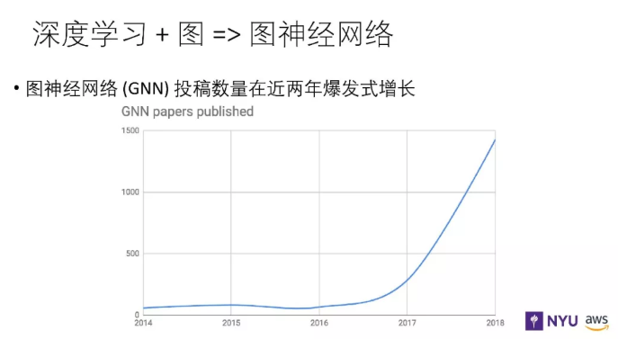
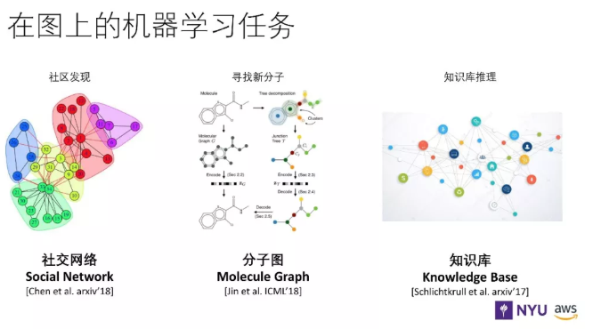
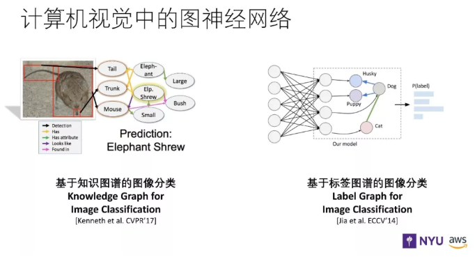
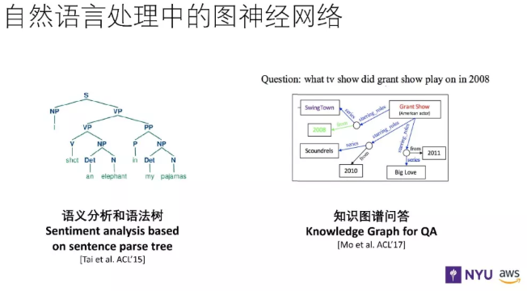
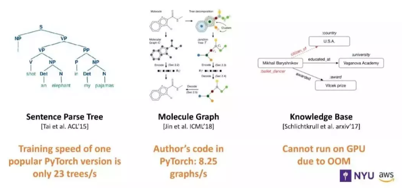
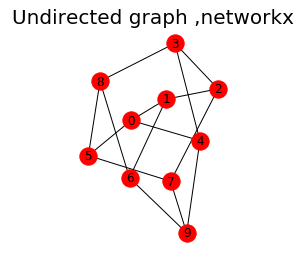
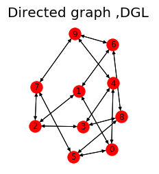

# DGL 入门

## 一、DGL 介绍

DGL 框架是由纽约大学和 AWS 工程师共同开发的开源框架，旨在为大家提供一个在图上进行深度学习的工具，帮助大家更高效的实现算法。

图神经网络在这两年很热，学术论文从 2016 年开始，增长相当迅速。而今年，可以说是该研究方向集中爆发的一年，像 ICML 有 30～50 篇论文是专门研究图学习的。




## 二、图广泛应用

图神经网络在机器学习、计算机视觉、自然语言处理等任务中的应用如下图所示：








## 三、DGL 框架设计理念

目前，比较成熟的深度学习框架主要包括：Tensorflow、Pytorch、MXNet、Keras等，这些深度学习框架虽然能够很方便的搭建出复杂多样化的神经网络模型，但是这些框架却在实现图神经网络模型方面具有很大的局限性。同时，所构建出的图神经网络模型性能较低。

下图例子分别介绍了不同深度学习框架搭建图神经网络模型时所出现的训练速度缓慢，内存溢出等问题。



**为什么 Tensorflow、Pytorch、MXNet、Keras 在搭建图神经网络模型过程中会出现这些问题呢?**

**第一个原因**在于图神经网络模型相比于深度神经网络模型，所采用的方法是消息传递。

消息传递的方法是这样的：
- 首先，图神经网络模型中每个节点在训练过程中，会向邻居节点发送该节点的此时消息，同时，该节点也会接受来自邻居节点的消息；
- 然后，该节点在获取到周围邻居节点消息之后，会对这些消息进行聚合，以计算该节点的新的表示。

**第二个原因**在于图神经网络模型与深度学习框架的计算机制不同，深度学习框架都是基于张量计算的，但是图神经网络模型在进行计算时，并非直接表示为一个完整的张量，而是需要手动补零，因此，也导致了深度学习框架在计算图神经网络模型时，容易出现速度变慢，内存溢出问题。

## 四、DGL 框架基础入门

### 4.1 DGL 基本操作

- 创建一个图（graph）；
- 读取和写入节点和边表示；

### 4.2 DGL 本次学习目标

- 创建一个简单的 networkx 图；
- networdx 图转化为 DGL 图；
- DGL 图转化为 networdx 图；
- 引入 petersen_graph 图。

### 4.3 Graph 图创建

#### 4.3.1 利用 networkx 引入 petersen 图

```python
import networkx as nx
import dgl

g_nx = nx.petersen_graph() # 引入了 petersen 图
g_dgl = dgl.DGLGraph(g_nx) # 将 petersen 图转化为 DGL Graph 形式

import matplotlib.pyplot as plt
plt.subplot(121)
plt.title('Undirected graph ,networkx',fontsize=20)
nx.draw(g_nx, with_labels=True) # 绘制带标签的无向图

plt.subplot(122)
plt.title('Directed graph ,DGL', fontsize=20)
nx.draw(g_dgl.to_networkx(), with_labels=True) # 绘制带标签的有向图

plt.show()
```





> 注：petersen 图特点介绍
> - 顶点数v=10
> - 边数e=15
> - 分支数ω=1
> - 各顶点的度为d(v)=3，因而它是三正则图（度:节点相连的边的数目）
> - 围长C=5（一个图的围长是指它所包含的最短圈的[边数]，Petersen图中无三圈与四圈，其围长为5）
> - 直径d=2（一个图两点间的距离指其间最短路的长，而它的直径则指全图中最大的距离）

#### 4.3.2 利用 DGL 创建图

下文，我们将采用 DGL 创建一个星型图，代码如下所示：

```python
import dgl
import torch as th

# step 1
g = dgl.DGLGraph()

# step 2
g.add_nodes(10)

# step 3
# a couple edges one-by-one
for i in range(1, 4):
    g.add_edge(i, 0)
# a few more with a paired list
src = list(range(5, 8)); dst = [0]*3
g.add_edges(src, dst)
# finish with a pair of tensors
src = th.tensor([8, 9]); dst = th.tensor([0, 0])
g.add_edges(src, dst)

# step 4
# edge broadcasting will do star graph in one go!
g.clear(); g.add_nodes(10)
src = th.tensor(list(range(1, 10)))
g.add_edges(src, 0)

# step 5
import networkx as nx
import matplotlib.pyplot as plt
nx.draw(g.to_networkx(), with_labels=True)
plt.show()
```


该代码的思路是这样的：
1. step 1 通过利用 dgl.DGLGraph() 方法创建一个图对象；
2. step 2 利用 g.add_nodes(10)，创建 10 个节点；
3. step 3 采用三种不同的方法创建节点与节点间的边；
4. step 4 清除原先构建的图，并重新进行构建；
5. step 5 绘制星型有向图。

### 4.4 Graph 特征分配

下面，我们将介绍如何为 DGLGraph 内的节点和边分配特征，这些特征将被表示为名称（strings）和 tensors 的词典，检测为 fields.

#### 4.4.1 节点特征分配

> 方法介绍：
> 
> 1、g.ndata['x']：特征初始化；
> 
> 2、g.nodes[index]：访问 graph 中的任意节点；
> 
> 3、g.nodes[index].data['x']：访问 graph 中索引为 index 的 node 的特征向量

以下代码，我们将为每一个节点分配一个 len 为 3 的向量。

```python
import dgl
import torch as th

x = th.randn(10, 3)
g.ndata['x'] = x
print(g.ndata['x'])
'''
    output:
    tensor([[-1.7702, -0.3649, -1.4942],
            [ 0.0730, -0.7347,  0.0027],
            [-0.8124,  0.1733, -0.2079],
            ...])
'''
```

ndata 是访问所有节点状态的 syntax sugar，状态存储在托管用户定义字典的容器数据中。

```python
print(g.ndata['x'] == g.nodes[:].data['x'])

# access node set with integer, list, or integer tensor
g.nodes[0].data['x'] = th.zeros(1, 3)
g.nodes[[0, 1, 2]].data['x'] = th.zeros(3, 3)
g.nodes[th.tensor([0, 1, 2])].data['x'] = th.zeros(3, 3)
'''
    output:
    tensor([[1, 1, 1],
            [1, 1, 1],
            [1, 1, 1],
            [1, 1, 1],
            ...], dtype=torch.uint8)
'''
```

#### 4.4.2 边特征分配

分配边缘特征的方式与节点特征的方式类似，只是可以通过指定边缘的端点来完成。

> 方法介绍：
> 
> 1、g.edata['w']：特征初始化；
> 
> 2、g.edges[index]：访问 graph 中的任意边；
> 
> 3、g.edges[index].data['w']：访问 graph 中索引为 index 的 edges 的特征向量

```python
g.edata['w'] = th.randn(9, 2)
print(g.edata['w'])
# access edge set with IDs in integer, list, or integer tensor
g.edges[1].data['w'] = th.randn(1, 2)
g.edges[[0, 1, 2]].data['w'] = th.zeros(3, 2)
g.edges[th.tensor([0, 1, 2])].data['w'] = th.zeros(3, 2)

# one can also access the edges by giving endpoints
g.edges[1, 0].data['w'] = th.ones(1, 2)                 # edge 1 -> 0
g.edges[[1, 2, 3], [0, 0, 0]].data['w'] = th.ones(3, 2) # edges [1, 2, 3] -> 0

'''
    output:
    tensor([[ 0.4185, -0.5519],
            [-0.5726,  0.6431],
            [-0.0181,  3.1070],
            [ 0.8962, -0.0104],
            ...])
    tensor([[ 0.4185, -0.5519],
            [ 0.2827, -1.9100],
            [-0.0181,  3.1070],
            [ 0.8962, -0.0104],
            ...])
    tensor([[ 0.0000,  0.0000],
            [ 0.0000,  0.0000],
            [ 0.0000,  0.0000],
            [ 0.8962, -0.0104],
            ...])
    tensor([[ 0.0000,  0.0000],
            [ 0.0000,  0.0000],
            [ 0.0000,  0.0000],
            [ 0.8962, -0.0104],
            ...])
    tensor([[ 1.0000,  1.0000],
            [ 0.0000,  0.0000],
            [ 0.0000,  0.0000],
            [ 0.8962, -0.0104],
            ...])
    tensor([[ 1.0000,  1.0000],
            [ 1.0000,  1.0000],
            [ 1.0000,  1.0000],
            [ 0.8962, -0.0104],
            ...])
'''
```

分配之后，每个 node/edge 字段将与包含其字段值的 shape 和 data type(dtype) 的方案相关联。

```python
print(g.node_attr_schemes())
g.ndata['x'] = th.zeros((10, 4))
print(g.node_attr_schemes())
'''
output:
{'x': Scheme(shape=(3,), dtype=torch.float32)}
{'x': Scheme(shape=(4,), dtype=torch.float32)}
'''

```

可以从图中删除 node/edge 的状态。

```python
g.ndata.pop('x')
g.edata.pop('w')
'''
output:
tensor([[ 1.0000,  1.0000],
        [ 1.0000,  1.0000],
        [ 1.0000,  1.0000],
        [-1.8158,  0.7256],
        ...])
'''
```

#### 4.5 Multigraphs

许多 graph 应用程序需要多边，可以使用 multigraph=True 实现。

```python
g_multi = dgl.DGLGraph(multigraph=True)
g_multi.add_nodes(10)
g_multi.ndata['x'] = th.randn(10, 2)

g_multi.add_edges(list(range(1, 10)), 0)
g_multi.add_edge(1, 0) # two edges on 1->0

g_multi.edata['w'] = th.randn(10, 2)
g_multi.edges[1].data['w'] = th.zeros(1, 2)
print(g_multi.edges())

'''output:
(tensor([1, 2, 3, 4, 5, 6, 7, 8, 9, 1]), tensor([0, 0, 0, 0, 0, 0, 0, 0, 0, 0]))
'''
```

使用其事件节点 u 和 v 无法唯一表示 multigraph 中的边，因此，需要采用 edge_id 接口查询其边 ID.

```python
eid_10 = g_multi.edge_id(1, 0)
g_multi.edges[eid_10].data['w'] = th.ones(len(eid_10), 2)
print(g_multi.edata['w'])

'''output:
tensor([[ 1.0000,  1.0000],
        [ 0.0000,  0.0000],
        [ 1.4364,  0.4434],
        [-0.1809,  0.7359],
        [-1.0965,  0.5050],
        [ 1.1591, -0.5784],
        [-0.2197, -0.5136],
        [-1.0789, -0.5628],
        [ 1.2346, -0.5913],
        [ 1.0000,  1.0000]])
'''
```


## 参考资料

1. [DGL Basics](https://docs.dgl.ai/tutorials/basics/2_basics.html)
2. [DGL 作者答疑！关于 DGL 你想知道的都在这里](https://mp.weixin.qq.com/s?__biz=MzI2MDE5MTQxNg==&mid=2649695390&idx=1&sn=ad628f54c97968d6fff55907c47cb77e)