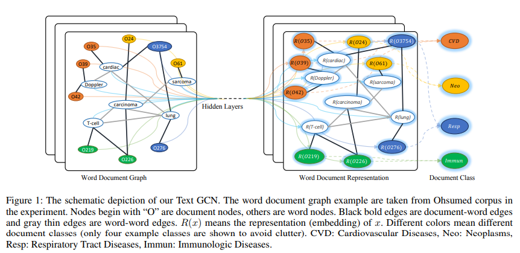

# Graph Convolutional Networks for Text Classification

## 摘要

​Text Classification is an important and classical problem in natural language processing. There have been a number of studies that applied convolutional neural networks (convolution on regular grid, e.g., sequence) to classification. 

However, only a limited number of studies have explored the more flexible graph convolutional neural networks (convolution on non-grid, e.g., arbitrary graph) for the task. (很少人利用 GCN 去处理该问题)

In this work, we propose to use graph convolutional networks for text classification. We build a single text graph for a corpus based on word co-occurrence and document word relations, then learn a Text Graph Convolutional Network (Text GCN) for the corpus. Our Text GCN is initialized with one-hot representation for word and document, it then jointly learns the embeddings for both words and documents, as supervised by the known class labels for documents. （在这项工作中，我们建议使用图卷积网络进行文本分类。 我们基于单词共现和文档单词关系为语料库构建单个文本图，然后为语料库学习文本图卷积网络（Text GCN）。 我们的文本GCN初始化为单词和文档的 one-hot 表示，然后联合学习单词和文档的嵌入，由已知的文档类标签监督。）

Our experimental results on multiple benchmark datasets demonstrate that a vanilla Text GCN without any external word embeddings or knowledge outperforms state-of-the-art methods for text classification. On the other hand, Text GCN also learns predictive word and document embeddings. In addition, experimental results show that the improvement of Text GCN over state-of-the-art comparison methods become more prominent as we lower the percentage of training data, suggesting the robustness of Text GCN to less training data in text classification.

## 动机

1、DL 可以很好地捕获局部连续单词序列中的语义和句法信息，但是可以忽略具有非连续和长距离语义的语料库中的全局单词共现。

2、GCN 的流行，图神经网络在被认为具有丰富的关系结构的任务中是有效的，并且可以在图嵌入中保留图的全局结构信息。

## 方法介绍

提出针对文本分类方法的 GCN，我们从整个语料库构建一个单独的大图，其中包含单词和文档作为节点。 我们使用图卷积网络（GCN）（Kipf和Welling 2017）对图进行建模，这是一种简单有效的图神经网络，可以捕获高阶邻域信息。 双字节点之间的边缘由字共现信息构成，字节点和文档节点之间的边缘使用字频和字的文档频率构建。 然后我们自然地将文本分类问题转化为节点分类问题。 该方法可以通过一小部分标记文档实现强分类性能，并学习可解释的单词和文档节点嵌入。

## 论文贡献

• We propose a novel graph neural network method for text
classification. To the best of our knowledge, this is the
first study to model a whole corpus as a heterogeneous
graph and learn word and document embeddings with
graph neural networks jointly.
• Experimental results on several benchmark datasets
demonstrate that our method outperforms state-of-the-art
text classification methods, without using any pre-trained
word embeddings or external knowledge. Our method can
also learn predictive word and document embeddings automatically.

## 方法详细介绍

### Graph Convolutional Networks (GCN)

### Text Graph Convolutional Networks (Text GCN)

我们构建了一个包含字节点和文档节点的大型异构文本图，以便可以显式建模全局字共现，并且可以轻松地调整图卷积，如图1所示。文本图中的节点数| V |是文档的数量（语料库大小）加上语料库中唯一单词的数量（词汇量大小）。我们简单地将特征矩阵X = I设置为单位矩阵，这意味着每个单词或文档都表示为单热矢量作为Text GCN的输入。我们基于文档中的单词出现（文档 - 单词边缘）和整个语料库中的单词共现（单词 - 单词边缘）在节点之间构建边缘。文档节点和单词节点之间的边缘的权重是文档中单词的频率 - 逆文档频率（TF-IDF），其中术语频率是单词在文档中出现的次数，反向文档frequency是包含该单词的文档数量的对数缩放的反向分数。我们发现使用TF-IDF重量仅比使用术语频率更好。为了利用全局词共现信息，我们在语料库中的所有文档上使用固定大小的滑动窗口来收集共现统计信息。我们采用逐点互信息（PMI）（一种流行的单词关联度量）来计算双字节点之间的权重。我们还发现，在我们的初步实验中，使用PMI比使用单词共现计数获得更好的结果。

$$
A_{i j}=\left\{\begin{array}{ll}{\operatorname{PMI}(i, j)} & {i \text { and } j \text { are words and } \operatorname{PMI}(i, j)>0} \\ {\mathrm{TF}-\mathrm{IDF}_{i j}} & {i \text { is a document and } j \text { is a word }} \\ {1} & {i=j} \\ {0} & {\text { otherwise }}\end{array}\right.
$$
