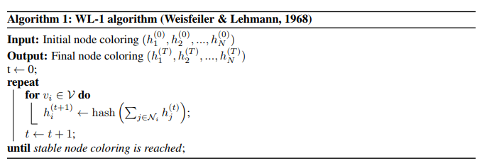
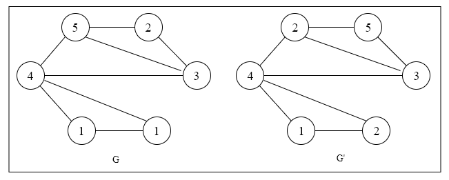
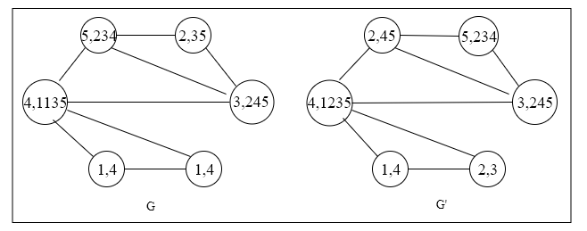
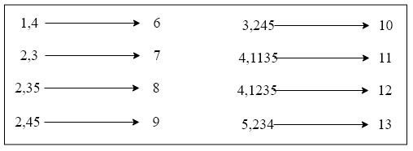
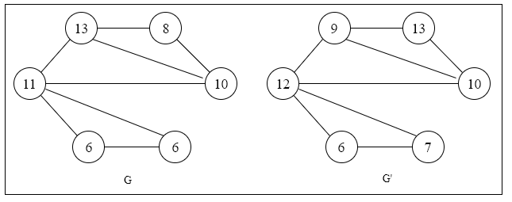

# Weisfeiler-Leman 算法介绍

## 一、引言

Graph 的相似性问题是指判断给定两个 Graph 是否同构。Weisfeiler-Lehman算法主要被用于解决 Graph 上的相似性问题。Weisfeiler-Lehman 算法通过从 Graph 中的节点独立性（Identifaction）方面入手，以获得每个 Graph 的节点独立性信息集合，最后通过计算 Graph 间节点独立性信息集合的相似性，以解决Graph的相似性问题。

## 二、Weisfeiler-Leman 算法介绍

### 2.1 动机

 Graph 的相似性问题是指判断给定两个 Graph 是否同构。为解决该问题，需要选择一种有效计算节点独立性（Identifaction）。理想情况下， Graph 结构数据的神经网络模型应该能够学习 Graph 中节点独立性（Identifaction），同时，考虑节点的 Graph 特征信息（attribute）和结构信息（structure）。本文采用 Weisfeiler-Leman 算法来衡量 Graph 中节点间独立性（Identifaction），以构建 Graph 的独立性（Identifaction）的节点集合。最后，通过将两个 Graph 的相似度问题转化为两个 Graph 的独立性（Identifaction）的节点集合的 Jaccard 相似度问题。

### 2.2 Weisfeiler-Leman 算法思路

一般地，Graph 中的每个节点都具有特征（attribute）和结构（structure）两种信息，需要从这两方面入手，来对节点作独立性（Identifaction）。很自然地，特征信息（attribute）是通过节点的邻居来刻画，独立性（Identifaction）可以通过 hashing 来高效判断。如果设 $c(v_i)$ 表示节点 $c(v_i)$ 的特征信息（attribute），那么 Weisfeiler-Leman 算法的更新函数可量化为：

$$
h_l^{(t)}(v)=\operatorname{HASH}\left(\left(h_{l}^{(t-1)}(v), \mathbb{f} h_l^{(t-1)}(u) | u \in N(v)\right\}\right) )
$$

Weisfeiler-Lehman (WL) 算法提供一个对于给定Graph 和（可选）离散初始节点标签的唯一分配的研究框架，如下图所示：

> 其中，$h_{i}^{(t)}$ 表示节点 $v_{i}$ 的颜色（标签分配）；
> 
> $\mathcal{N}_{i}$ 是其相邻节点索引的集合（无论 Graph 是否包含每个节点的自连接）；
> 
> $\operatorname{hash}(\cdot)$ 表示 $\operatorname{hash}()$ 函数，理想性质：满足仅有相同的输入才有相同的输出，这里相当于对每个节点都计算了一个映射关系。

Weisfeiler-Lehman (WL) 算法的思路是这样的，通过迭代地对邻居节点信息进行聚合，以判断当前中心节点独立性 （Identifaction），从而更新整个 Graph 中节点$u_{i}$的颜色（标签分配）。

### 2.3 Weisfeiler-Leman 算法图形举例说明

给定两图G和G'，其中每个节点都已经打上了标签（实际应用中，有些时候我们并拿不到节点的标签，这时可以对节点都标上“1”这个标签）

> 给定带标签的 Graph $G$ 和 $G'$

如何比较 $G$ 和 $G'$的相似性问题呢？Weisfeiler-lehman 算法的思路如下：

step 1、对邻居节点标签信息进行聚合，以获得一个带标签的字符串（整理默认采用升序排序的方法进行排序）。

> 第一步的结果，这里需要注意，图中利用逗号将两部分进行分开，第一部分是该节点的编号，第二部分是该节点的邻居节点集按升序排序的结构（eg：对于节点 5，他的邻居节点为2，3，4，所以他的结果为"5,234"）

step 2、为了能够生成一个一一对应的字典，我们哈希对每个节点的字符串进行处理。

step 3、将哈希处理过的值重新赋值给相应的结点，以完成第一次迭代。

第一次迭代的结果为：$G={6、6、8、10、11、13}，G'={6，7，9，10，12，13}$。这样即可以获得Graph 中每个节点独立性。接下去，可以采用 Jaccard 公式计算$G$ 和 $G'$的相似度。

## 三、Weisfeiler-Leman 算法与 GCN 间的转换

我们可以将 Weisfeiler-Leman 算法的更新函数中的哈希函数替换为具有可训练参数的神经网络层可微函数：

$$
h_{i}^{(l+1)}=\sigma\left(\sum_{j \in \mathcal{N}_{i}} \frac{1}{c_{i j}} h_{j}^{(l)} W^{(l)}\right)
$$

> 其中，$C_{i j}$ 为边 $\left(v_{i,} v_{j}\right)$ 的适当选择的归一化常数；
> 
> 进一步，我们能够设置 $h_{i}^{(l)}$ 作为在 $l^{\mathrm{h}}$ 层神经网络结点 $i$ 的激活向量
> 
> $W^{(l)}$ 是一个特殊层权重矩阵；
> 
> $\sigma(\cdot)$ 表示可微，非线性激活函数。

通过选择 $c_{i j}=\sqrt{d_{i} d_{j}}$，其中 $d_{i}=\left|\mathcal{N}_{i}\right|$ 表示结点 $v_{i}$ 的度，我们发现在下面公式中的向量中的 GCN 模型传播规则。

$$
H^{(l+1)}=\sigma\left(\tilde{D}^{-\frac{1}{2}} \tilde{A} \tilde{D}^{-\frac{1}{2}} H^{(l)} W^{(l)}\right)
$$

简单地说，这允许我们将 GCN 模型解释为图上的 1-Dim Weisfeiler-Lehman算法的可微分和参数化推广。

## 三、Weisfeiler-Leman 算法与 GCN 的价值

通过与 Weisfeiler-Lehman 算法的类比，我们可以理解即使是具有随机权重的未经训练的 GCN 模型也可以作为图中节点的强大特征提取器。

