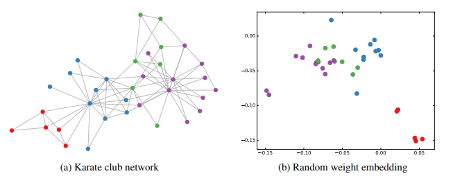
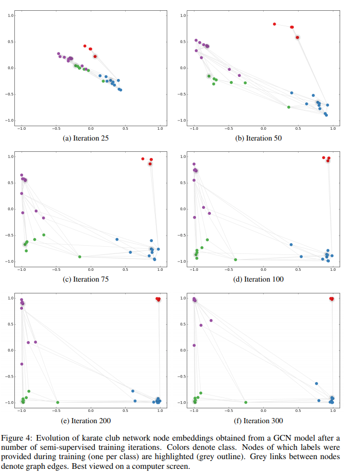

# WEISFEILER-LEHMAN ALGORITHM

理想情况下，图结构数据的神经网络模型应该能够学习图中节点的表示，同时，考虑节点的图结构和特征描述。

1-dim Weisfeiler-Lehman (WL-1) 算法提供一个对于给定图和（可选）离散初始节点标签的唯一分配的研究框架。

> 其中，$h_{i}^{(t)}$ 表示节点$u_{i}$的颜色（标签分配）；
> $\mathcal{N}_{i}$ 是其相邻节点索引的集合（无论图是否包含每个节点的自连接）；
> $\operatorname{hash}(\cdot)$ 表示 hash 函数。

有关 WL-1 算法的深入数学讨论可以研究 [David 2011](https://hal.inria.fr/inria-00541855/document)

我们可以将算法 1 中的哈希函数替换为具有可训练参数的神经网络层可微函数：

$$
h_{i}^{(l+1)}=\sigma\left(\sum_{j \in \mathcal{N}_{i}} \frac{1}{c_{i j}} h_{j}^{(l)} W^{(l)}\right)
$$

> 其中，$C_{i j}$ 为边 $\left(v_{i,} v_{j}\right)$ 的适当选择的归一化常数；
> 进一步，我们能够设置 $h_{i}^{(l)}$ 作为在 $l^{\mathrm{h}}$ 层神经网络结点 $i$ 的激活向量
> $W^{(l)}$ 是一个特殊层权重矩阵；
> $\sigma(\cdot)$ 表示可微，非线性激活函数。

通过选择 $c_{i j}=\sqrt{d_{i} d_{j}}$，其中 $d_{i}=\left|\mathcal{N}_{i}\right|$ 表示结点 $v_{i}$ 的度，我们发现在下面公式中的向量中的 GCN 模型传播规则。

$$
H^{(l+1)}=\sigma\left(\tilde{D}^{-\frac{1}{2}} \tilde{A} \tilde{D}^{-\frac{1}{2}} H^{(l)} W^{(l)}\right)
$$

简单地说，这允许我们将 GCN 模型解释为图上的 1-Dim Weisfeiler-Lehman算法的可微分和参数化推广。

## A.1 NODE EMBEDDINGS WITH RANDOM WEIGHTS

通过与 Weisfeiler-Lehman 算法的类比，我们可以理解即使是具有随机权重的未经训练的 GCN 模型也可以作为图中节点的强大特征提取器。

例如：对于以下的三层 GCN 模型：

$$
Z=\tanh \left(\hat{A} \tanh \left(\hat{A} \tanh \left(\hat{A} X W^{(0)}\right) W^{(1)}\right) W^{(2)}\right)
$$

使用 [ Glorot & Bengio(2010).](http://proceedings.mlr.press/v9/glorot10a/glorot10a.pdf) 中描述的初始化随机初始化权重矩阵 $W^{(l)}$ 。

我们在 Zachary’s karate club network [(Zachary, 1977)](http://www1.ind.ku.dk/complexLearning/zachary1977.pdf)上应用应用这个模型。 该图包含 34 个节点，和 154 条边（无向和非权重）。每个节点标注为四个类中一个，通过基于模块化的聚类获得。如下图所示：

> 上图左：Zachary’s karate club network [(Zachary, 1977)](http://www1.ind.ku.dk/complexLearning/zachary1977.pdf)，颜色表示通过基于模块化聚类获得的
> 
> 上图右：从未训练的三层 GCN 模型获取 emb，并随机应用于  karate club network。

我们通过设置 $X=I_{N}$ 来采用无特征方法，其中，$I_{N}$ 为 N维单位矩阵。$N$ 是图中节点的数量。注意到结点是随机排序的。因此，我们选择隐藏层维度为 4 和 二维输出（以便输出可以立即在 2 维图中可视化）。

上图右表示从应用于 karate club network 的未训练的 GCN 模型中获取节点 emb （输出 Z）的代表性示例。

这个结果与从 DeepWalk（[Perozzi et al., 2014](http://www.perozzi.net/publications/14_kdd_deepwalk.pdf)）获得的 emb 相当，后者使用更加昂贵的无监督训练程序。

## A.2 SEMI-SUPERVISED NODE EMBEDDINGS

在应用于 karate club network 的 GCN 的简单示例中，观察 emb 在训练期间如何对半监督分类任务作出反应是有趣的。

这种可视化（参见图4）提供了关于GCN模型如何利用图结构（以及从后面的图层结构中提取的特征）来深入了解对分类任务有用的 emb 的见解。

We consider the following semi-supervised learning setup: we add a softmax layer on top of our model (Eq. 13) and train using only a single labeled example per class (i.e. a total number of 4 labeled nodes). We train for 300 training iterations using Adam (Kingma & Ba, 2015) with a learning rate of 0.01 on a cross-entropy loss.

Figure 4 shows the evolution of node embeddings over a number of training iterations. The model succeeds in linearly separating the communities based on minimal supervision and the graph structure alone. A video of the full training process can be found on our website7.

