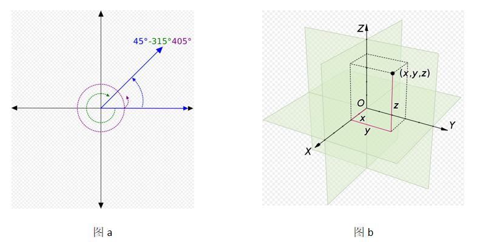
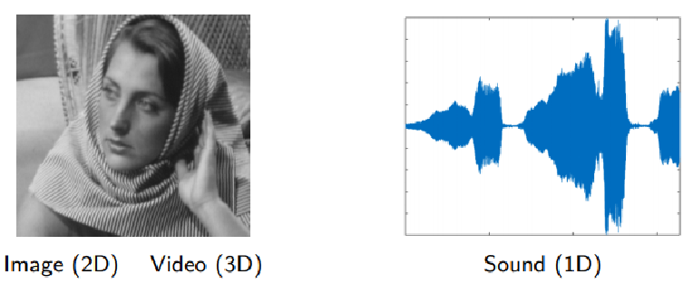
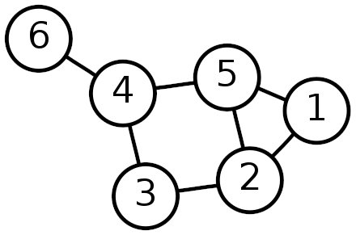
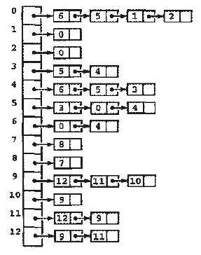
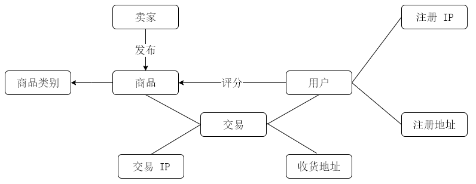

# Graph 介绍

## 引言

图卷积神经网络（Graph Convolutional Network）作为最近几年兴起的一种基于图结构的广义神经网络结构，因为其独特的计算能力，而受到广泛学者的关注与研究。传统深度学习模型 LSTM 和 CNN 在欧几里得空间数据（语言，图像，视频等）上取得了不错的成绩，但是在对非欧几里得空间数据（eg：社交网络、信息网络等）进行处理上却存在一定的局限性。

针对该问题，研究者们引入了图论中抽象意义上的图（Graph）来表示非欧几里得结构化数据。并利用图卷积网络对来图（Graph）数据进行处理，以深入发掘其特征和规律。

本文首先分别介绍了欧几里得结构化数据和非欧几里得结构化数据特点；然后，针对非欧几里得结构化数据的表示问题，引入了图论中抽象意义上的图（Graph）概念，并对图（Graph）中一些表示形式进行介绍；最后，通过一个简单的例子，对图（Graph）数据的应用进行介绍。以帮助读者加深对图（Graph）的理解。

## 一、欧几里得结构化数据

### 1、欧几里得空间

欧几里德空间(Euclidean Space)，简称为欧氏空间(也可以称为平直空间)，在数学中是对欧几里德所研究的2维和3维空间的一般化。这个一般化把欧几里德对于距离、以及相关的概念长度和角度，转换成任意数维的坐标系。如下图所示。

> 图 a 表示二维欧几里得空间

> 图 b 表示三维欧几里得空间

### 2、 常见的欧几里得结构化数据

将数据转换到欧几里得空间中，所得到的数据称为**欧几里得结构化数据**。

常见的欧几里得结构化数据主要包含：

- 1D：声音，时间序列等；
- 2D：图像等；
- 3D：视频，高光谱图像等；

## 二、非欧几里得结构化数据

### 1、非欧几里得空间

然而，科学研究中并不是所有的数据都能够被转换到欧几里得空间中（eg：社交网络、信息网络等），对于不能进行欧几里得结构化的数据，我们将其称为非欧几里得结构化数据。

### 2、 非常见的欧几里得结构化数据

常见的非欧几里得结构化数据主要包含：

- 1D：社交网络（eg：Facebook，Twitter等）等；
- 2D：生物网络（基因，分子，大脑连接）等；
- 3D：基础设施网络（eg：能源，交通，互联网，通信等）等；

## 三、图（Graph）

### 1、图（Graph）的引入

针对非欧几里得结构化数据表示问题，研究者们引入了图论中抽象意义上的图（Graph）来表示非欧几里得结构化数据。

### 2、图（Graph）的定义

图（Graph）定义形式为$\mathcal{G}=(\mathcal{V}, \mathcal{E})$，其结构如下图所示：

> 一个有标号的简单图，点集V={1,2,3,4,5,6}，边集E={{1,2},{1,5},{2,3},{2,5},{3,4},{4,5},{4,6}}

$\mathcal{V}=\{v_{i} | i=1, \ldots, N\}$ 表示顶点或节点。$\mathcal{E}=\{e_{i j} | v_{i}, v_{j} \in \mathcal{V}\},\|\mathcal{E}\| \leq N^{2}$ 表示顶点与顶点之间所连接的边；

### 3、图（Graph）的表示形式

#### （1）、邻接矩阵（Adjacency matrix）

邻接矩阵是一个元素为bool值或权值的$V*V$矩阵，该矩阵的定义如下：

$A \in \mathbb{R}^{N \times N}, A_{i j}=\left\{\begin{array}{cc}{a_{i j} \neq 0} & {e_{i j} \in \mathcal{E}} \\ {0,} & {\text { otherwise }}\end{array}\right.$

若图中存在一条连接顶点$V$和$V$的边$e_{i j}$，则$a_{i j} \neq 0$,否则为0。占用的空间为$V*V$，当图是稠密时，邻接矩阵是比较合适的表达方法。如下图所示：

> 上图的邻接矩阵表示

#### （2）、度矩阵（ Degree matrix）

度矩阵（ Degree matrix）是一个 $D_{i,i}$ 为节点$v_i$的度的对角矩阵，其定义如下所示：

$$
D \in \mathbb{R}^{N \times N}, D_{i i}=\sum_{j} A_{i j}
$$

#### （3）、邻域（ Neighborhood）

邻域（ Neighborhood） 表示与某个顶点有边连接的点集，其定义如下所示：

$$
\mathcal{N}\left(v_{i}\right)=\left\{v_{j} | e_{i j} \in \mathcal{E}\right\}
$$

> 上式表示与顶点$v_i$有边连接的邻域。

#### (4)、邻接表表示

对于非稠密的图，使用邻接矩阵有点浪费存储空间，可以使用邻接表，我们维护一个链表向量，给定一个顶点时，可以立即访问其链表,占用的空间为 $O(V+E)$，如下图所示。

## 四、图卷积神经网络的应用举例

对于一个简单的电商的图，其包含卖家，商品和用户三个关键节点，其中，商品节点关联商品类别节点，用户节点关联注册 IP 节点和 注册地址节点。当用户在购买商品时，用户节点和商品节点就会关联交易节点，同时，交易节点也会关联用户下单时所对应的 IP 节点以及收获地址节点，对应的图结构如下图所示。

从图数据中节点间的关系以及特征，我们可以进行反欺诈以及商品推荐的操作。

1. 反欺诈：因为图中每个节点都拥有自己的特征信息。通过该特征信息，我们可以构建一个风控系统，如果交易节点所关联的用户 IP 和收获地址与用户注册 IP 和注册地址不匹配，那么系统将有可能认为该用户存在欺诈风险。
2. 商品推荐：图谱中每个节点都具有结构信息。如果用户频繁购买某种类别商品或对某种类别商品评分较高，那么系统就可以认定该用户对该类商品比较感兴趣，所以就可以向该用户推荐更多该类别的商品。

总而言之，图数据的丰富应用价值促使更多的研究者加入图数据的研究当中，但是对图数据进行数据分析时，我们需要同时考虑到节点的特征信息以及结构信息。如果靠手工规则来提取，必将失去很多隐蔽和复杂的模式，那么有没有一种方法能自动化地同时学到图的特征信息与结构信息呢？——图卷积神经网络（Graph Convolutional Network）。

## 五、图上的学习任务

介绍完图的基本术语之后，我们来看看有了图结构数据，我们可以进行哪些机器学习的任务

- 图节点分类任务：图中每个节点都有对应的特征，当我们已知一些节点的类别的时候，可以设计分类任务针对未知节点进行分类。我们接下来要介绍的 GCN、GraphSAGE、GAT模型都是对图上的节点分类。
- 图的分类：对于整个图来说，我们也可以对图分类，图分类又称为图的同构问题，基本思路是将图中节点的特征聚合起来作为图的特征，再进行分类。

## 参考资料

https://www.ezlippi.com/blog/2014/11/graph.html
https://zhuanlan.zhihu.com/p/58792104