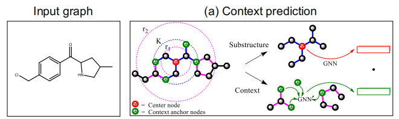

# Pre-training Graph Neural Networks

## 0 引言

前一篇博文[GNN 教程：图上的预训练任务上篇](https://archwalker.github.io/blog/2019/07/18/GNN-Pretain-0.html)已经向大家介绍了图上的预训练模型，该预训练模型通过设计边重建、Centrality Score Ranking、保留图簇信息三种图预训练任务来生成节点embedding，以从局部到全局上捕获图结构信息的不同属性；然后，将预训练模型在特定的任务中做微调，最终应用于该特定任务中。

本博文将向大家介绍来自论文 [Pre-training Graph Neural Networks](https://arxiv.org/abs/1905.12265) 的图上的另一种预训练模型，该论文 重点讨论下面三个问题：

1. 如何构建节点 embeddings，才能捕获节点邻居的结构相似性；
2. 如何构建可组合的节点 embeddings，以合并为精确的图级别表示；
3. 如何构建节点 embeddings，使其能够捕获独立节点和整个图上的领域知识。

## 1 动机

虽然 GNN 模型及其变体在图结构数据的学习方面取得了成功，但是 GNNs 存在以下两个主要挑战：

1. 目前应用于特定领域的 GNNs 算法，主要属于有监督学习算法，该算法需要采用大量带标注的图数据进行训练，才能获得更高准确度的模型。然而，由于带标签数据的极度稀缺以及标注成本过高等问题，导致 GNNs 训练模型容易出现过拟合现象；
2. 在 GNNs 中，需要预测测试集中的一些图，这些图具有不同于训练集中所包含图的图结构，导致容易陷入 out-of-distribution 预测问题。举个例子，预测新合成的，与训练集分子结构不同的分子的化学属性，或者来自新物种的蛋白质的功能，其具有与先前研究的物种不同的PPI网络结构。

## 2 GNNs 的预训练策略

本节将向大家介绍如何利用预训练 GNNs ，来生成满足以下目标的节点 embedding：

1) 捕获邻居结构的结构相似性；
2) 可组合的节点 embeddings，以合并为精确的图级别表示；
3) 捕获独立节点和整个图上的领域知识。

通过如下图所示的策略实现这些目标，该策略（eg：Context Prediction，Masking，Graph-level Prediction）覆盖了 node-level 和 graph-level 的预训练。

> 上图介绍了用于 GNNs 的预训练方法的类别

### 3.1 Context Prediction：学习捕获局部图结构的节点 embeddings

大多数现有的现成无监督节点表示学习方法被设计用于节点分类，并且要求附近节点具有类似的 embeddings。这不适用于整个图的表示学习，其中捕获局部邻域的结构相似性更重要。

NLP 领域中提出了一种有效的分布式假设(distributional hy pothesis)，该分布式假设假设词语的表示反映了它们的上下文，也就是它认为，有相似上下文的单词的语义也是相近的。举个例子，“姚明” 和 “易建联” 都是篮球运动员，所以他们可能会出现在相同上下文中。

受 NLP 中所提出的分布式假设的启发，论文将分布式假设应用于复杂图领域中，以更好的训练 GNNs 预训练模型。这里需要解决以下两个问题：

1) 如何在图领域中定义 “词” 和 “上下文”；
2) 如何在预测问题中表示上下文。

下面将对上述问题的解决方法进行介绍。

#### 在图领域的 “词” 和 “上下文”

如何在图领域中定义与 NLP 中单词类似的“词”呢？这里主要采用 GNNs 编码中心节点为 $v$ 的 K-hop 子图结构，以获得最终的节点 embeddings $h_v^{(K)}$ 。因此，如果我们使用最终的节点 embeddings $h_v^{(K)}$ 去预测上下文时，在图领域的“词”将被视为节点 $v$ 的 K-hop 子图结构（Substructure）。该子图结构（Substructure）如下图所示。

类似地，上下文（Context）可以被定义为围绕 K-hop 子图的图结构。例如：中心节点中 r1-hop 和 r2-hop 间的子图，该上下文（Context）如下图所示。这里需要要求 $r_1 < K$ ,才能让一些节点在子图结构（Substructure）和上下文（Context）间被分享。

> 从图中主要介绍预训练 GNNs 的 Context Prediction，在 Context Prediction 中子图结构（Substructure）和上下文（Context）的定义如下：
> 子图结构（Substructure）被定义为围绕被选中心节点的 K-hop 子图，其中，K 表示 GNN 层的数量，在上图中 K 设置为 2。
> 上下文（Context）被定义为位于中心节点的 r1-hop 和 r2-hop 间的周围子图。上图中，r1=1 和 r2=4。

#### 使用另一个 GNN 将上下文编码到一个固定向量中

与 NLP 不一样，图领域中的上下文（Context）是一个结构对象，作为预测目标是不一样的。通过使用另外一个带有可训练参数的GNN，将结构对象编码为一个固定长度的向量。

为了获取针对上下文（Context）的信息，首先，在上下文图中，应用上下文（Context） GNNs 获取节点 embeddings；然后，对上下文 anchor 节点中的 embeddings 进行平均，以获取固定长度的上下文 embeddings 作为 $\overline{c}_v^G$。

#### 通过负采样进行训练

本节我们将介绍如何采用负采样联合训练两个 GNNs：

1) 编码子结构（substructure）以获得节点 embeddings $h_v^{(K)}$；
2) 对图 $G'$ 中节点 $v'$ 编码上下文以获得上下文 embeddings $C_{v^{\prime}}^{G^{\prime}}$。

特别地，训练对象是一个给定子结构上下文对（$h_v^{(K)}$，$C_{v^{\prime}}^{G^{\prime}}$）是 True 还是 False 的二分类器。

$$
\sigma\left(h_v^{(K) \top} c_{v^{\prime}}^{G^{\prime}}\right) \approx 1\left\{v \text { and } v^{\prime} \text { are the same node in } G\right\}
$$

其中，$\sigma(\cdot)$ 是一个 sigmoid 函数，$\mathbf{1}(\cdot)$ 是指示符函数。让 $v^{\prime}=v$ 和 $G^{\prime}=G$（对于正子结构上下文对），或者从随机选择的图$G^{\prime}$中随机采样 $v^{\prime}$（对于负子结构上下文对）。同时，使用 1 的负采样比率和使用 negative log likelihood 作为损失函数。

在训练结束之后，第一个 GNN 将具有相似周围上下文的子结构映射到 embedding 空间中的相似向量中。

在这里做一个小结，本节向大家介绍如何利用预训练 GNNs ，来生成节点 embedding，以捕获邻居结构的结构相似性的方法，并将该方法称为上下文预测。作为新的自监督节点级预训练方法，上下文预测将分布式假设应用于图领域。特别是，使用节点 embeddings 来预测周围的图结构，因此具有相似周围图结构的节点将被映射到相似的表示中。

### 3.2 Masking：训练节点 embeddings 以获得领域知识

在 NLP 领域中，BERT 预训练模型的本质是mask语言模型，它采用自监督预测任务来促使模型捕获与语言相关的有价值领域知识。

受 BERT 启发，对于图结构数据，本节介绍一种 mask 与节点和边相关联的特定领域属性，然后利用 GNN 根据邻居结构去预测这些属性的方法。如下图所示。

> 如上图所示，我们将该方法应用于分子结构图。首先，mask 输入的节点/边的属性；然后，应用 GNNs 获取相应的节点/边 embeddings（通过简单地总结其两个端点地 embeddings 来获得边 embeddings）；最后，在 embeddings 上使用一个线性模型来预测被mask的节点/边的属性。

这里做一个小结，本节中介绍了利用mask来让模型学习有意义的邻居结构，这些结构能够反映出特定领域知识。如上图所示，通过对分子结构图进行mask，GNNs 能够学习到简单的化学规则（例如：价），和可能更复杂的化学现象（例如：官能团的电子或空间性质）。

### 3.3 图级别预测：训练可组成的节点 embeddings

本节主要介绍如何获取能够捕获图结构或者领域知识的节点 embeddings。这里介绍两种图级别预训练的方法来学习可组合的 embeddings：

1) 通过对特定领域的辅助监督任务进行预测;
2) 通过对图级别结构进行自监督预测，例如图距离或图结构相似性。

由于图级别表示将直接用于下游图级预测任务的微调，所以需要将特定于域的信息直接编码到图 embeddings 中。因此，本节专注于第一种方法，并为 GNNs 的图级别监督预训练引入领域特定的任务。如下图所示。

这里做一个小结，本节中介绍了利用预训练 GNNs 来生成具有可组合性节点 embeddings 。通过对这些可组合性节点 embeddings 进行有效的组合，能够获得整个图的有效表示，以确保节点和图 embeddings 都是高质量性；因此，图 embeddings 更稳健并且可以转移到各种下游任务。
